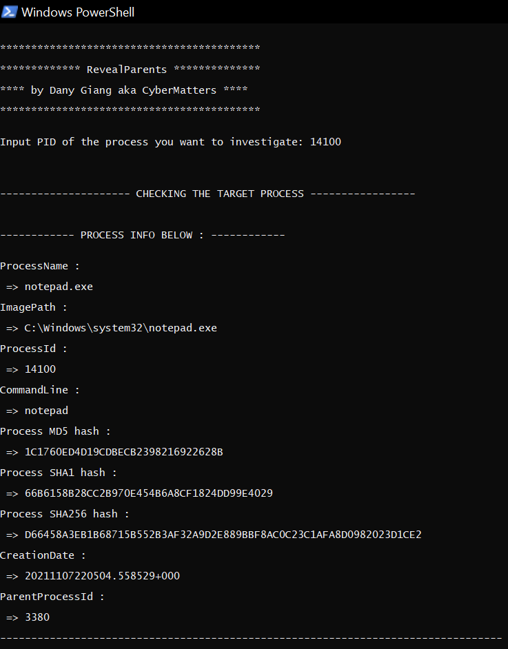
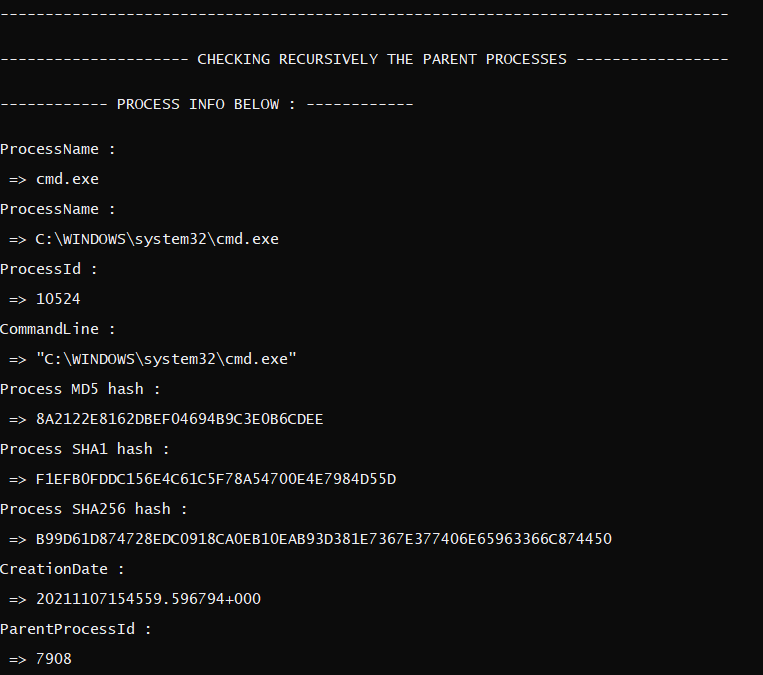
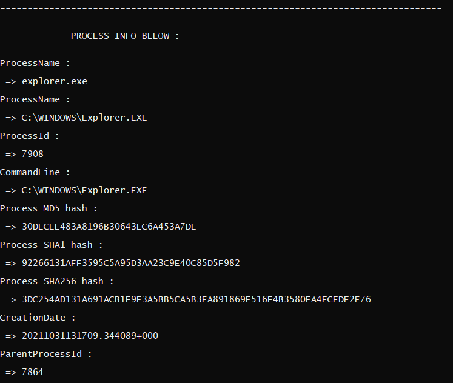

# RevealParents

Program written by Dany Giang aka CyberMatters.

## Overview

During their investigations, SOC and CERT analysts often need to analyze running processes.
One way to identify suspicious behaviors and illegitimate processes is take a look at parent processes.
RevealParents display information about all the running parent processes of a target process.

Simply execute the script with the following command:

* `.\RevealParents`

RevealParents take a PID as input and then will recursively display information about the parent processes :

* ProcessName
* ProcessId
* CommandLine
* Hashes (MD5, SHA1, SHA256)
* CreationDate (YYYYMMDDHHMMSS)
* ParentProcessId

If the script completes successfully you should see this in your terminal :

/!\ If a parent process is not running anymore, its information will not be displayed. /!\

## Requirements

* On Windows computers, the default powershell [execution policy](https://docs.microsoft.com/en-us/powershell/module/microsoft.powershell.core/about/about_execution_policies?view=powershell-7.1) is set to `Restricted` which means it is not possible to execute scripts.
* You can change the policy with the powershell command [`Set-ExecutionPolicy`](https://docs.microsoft.com/en-us/powershell/module/microsoft.powershell.security/set-executionpolicy?view=powershell-7.1)
